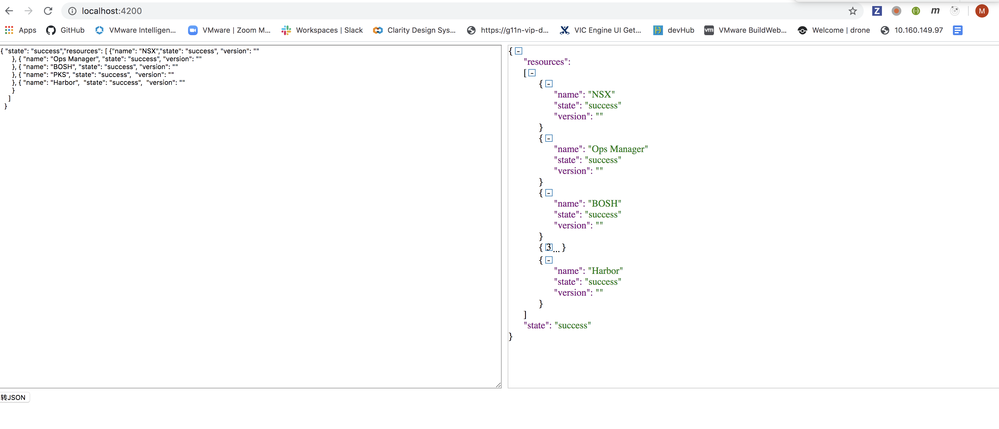

# JSON formatter by Angular

This project was generated with [Angular CLI](https://github.com/angular/angular-cli) version 8.3.3. There is lots of json formatter. This project built by angular and introduced jQuery to manipulating the dom element. 


## Development server

Run `ng serve` for a dev server. Navigate to `http://localhost:4200/`. The app will automatically reload if you change any of the source files.

## Code scaffolding

Run `ng generate component component-name` to generate a new component. You can also use `ng generate directive|pipe|service|class|guard|interface|enum|module`.

## Build

The code of the JSON Editor is located in the folder `./src`. To build 
jsoneditor:

- Install dependencies:

  ```
  npm install
  ```

- Build JSON Editor:

  ```
  npm run build
  ```

  This will build the project.

- To automatically build when a source file has changed:

  ```
  npm start
  ```

## Running unit tests

Run `ng test` to execute the unit tests via [Karma](https://karma-runner.github.io).

## Running end-to-end tests

Run `ng e2e` to execute the end-to-end tests via [Protractor](http://www.protractortest.org/).

## Further help

To get more help on the Angular CLI use `ng help` or go check out the [Angular CLI README](https://github.com/angular/angular-cli/blob/master/README.md).
# json-format
